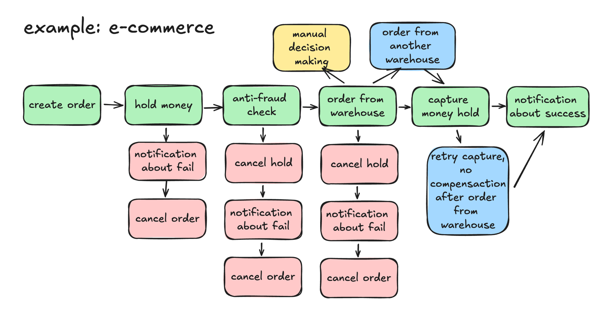
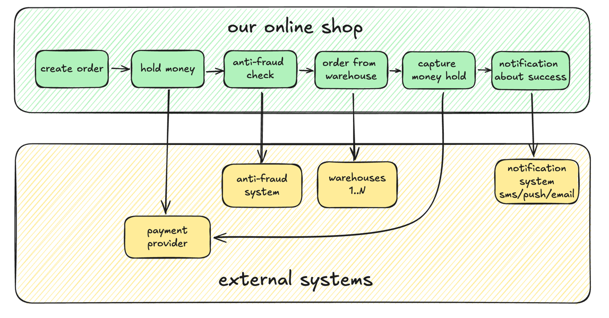
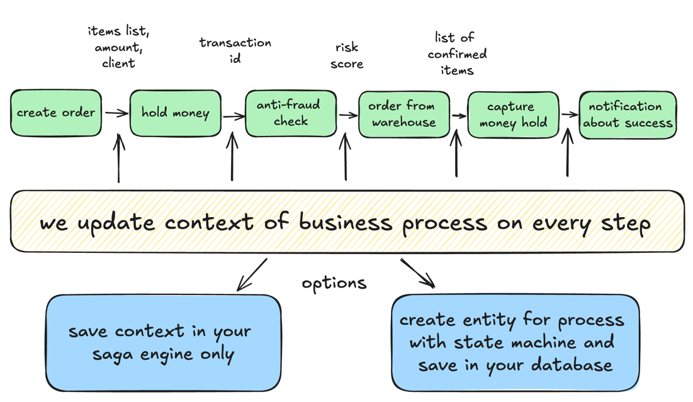

# Online shop - example of SAGA pattern using temporal

## Imaginary domain description







## Requirements

- Java 17
- Gradle
- Docker Compose

## Quick start

Execute following commands:

```sh
docker-compose up -d
./gradlew bootRun
```

## Tools:

Adminer to check the database: http://localhost:8081

Temporal admin panel: http://localhost:8082

## Endpoints:

Start new order processing:

http://localhost:8080/processOrder

Show all orders:
http://localhost:8080/showOrders
